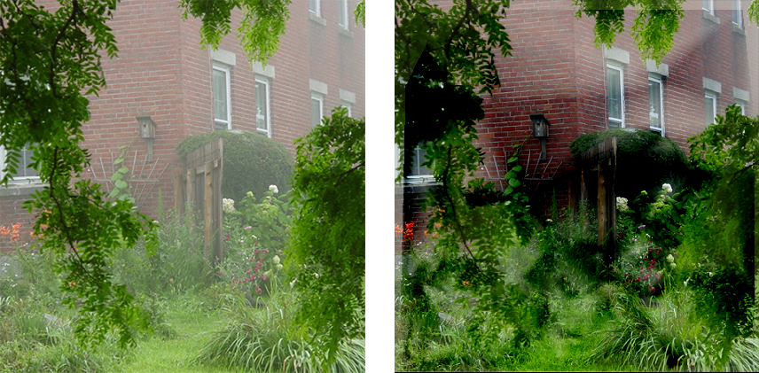

## Dehazing using Color-lines
This repository is an open-source implementation of [Fattal's algorithm for dehazing](https://www.cse.huji.ac.il/~raananf/projects/dehaze_cl/). 
It is meant as an accessible implementation with low complexity and ample documentation that can be used as an aid for studying the algorithm.   
  

This is **not** an efficient implementation; dehazing a single image can take up to a minute on a modern cpu. For an efficient implementation, consider the implementations by [Ekesium](https://github.com/ekexium/dehazing-using-color-lines) and [Tomlk](https://github.com/Tomlk/Dehazing-with-Color-Lines) (same pixelwise inference, but in scala and C++). Alternatively, consider writing a vectorized implementation. 

## How to Use 
Use a venv and install the required packages by running `pip install -r requirements.txt`. 
By executing `python dehaze.py` the algorithm will dehaze `bricks.png`. 

## todos 
* Implement MRF for interpolation and regularization (currently only linear interpolation, which causes artifacts)
* Implement [automatic airlight recovery](https://www.cse.huji.ac.il/~raananf/projects/atm_light/)
